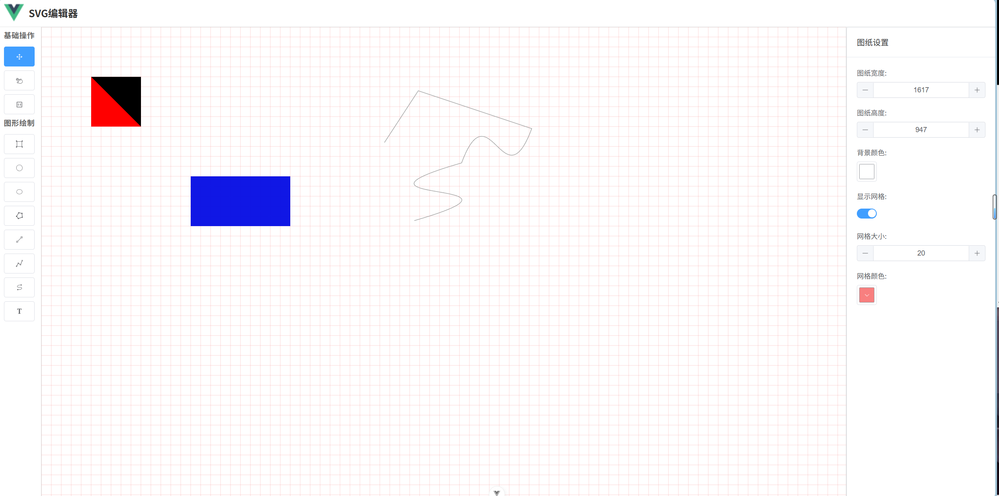

# SVG编辑器 - Vue 3 实现

**作者**: kkdlk

这是一个基于 Vue 3 + Vite 开发的 SVG 图形编辑器，提供完整的 SVG 编辑功能，支持多种绘图工具、样式编辑、元素管理等。

## 技术栈

- **框架**: Vue 3 (Composition API)
- **构建工具**: Vite
- **UI组件库**: Element Plus
- **样式**: SCSS
- **核心功能**: 自定义 SVG 编辑引擎

## 功能截图




## 项目架构

### 目录结构

```
graphic-editor-vue/
├── src/
│   ├── svgeditjs/              # SVG编辑器核心包
│   │   ├── components/         # Vue组件
│   │   ├── constant/           # 常量定义
│   │   ├── core/               # 核心管理类
│   │   ├── drawing/            # 绘图工具
│   │   ├── event/              # 事件系统
│   │   ├── expand/             # 扩展资源
│   │   ├── extend/             # 扩展功能
│   │   ├── utils/              # 工具函数
│   │   └── SvgEditor.js        # 编辑器入口
│   ├── App.vue                 # 应用入口组件
│   └── main.js                 # 应用入口文件
├── public/                     # 静态资源
├── index.html                  # HTML模板
├── package.json                # 项目配置
├── vite.config.js              # Vite配置
└── README.md                   # 项目文档
```

### 核心组件

| 组件名称                         | 功能描述                           |
| -------------------------------- | ---------------------------------- |
| SvgEditorContainerComponent      | 编辑器主容器，整合所有子组件       |
| SvgHeaderEditorComponent         | SVG头部信息编辑器                  |
| SvgEditorToolbarComponent        | 绘图工具栏，提供各种绘图工具       |
| SvgEditorPaperContainerComponent | 画布容器，处理SVG内容渲染和交互    |
| SvgStyleEditorComponent          | 样式编辑器，包括元素样式和画布样式 |

### 核心管理类

| 类名             | 功能描述                        |
| ---------------- | ------------------------------- |
| CanvasManager    | 画布管理，处理缩放、平移等      |
| DrawingManager   | 绘图管理，处理各种图形的绘制    |
| ElementManager   | 元素管理，处理SVG元素的增删改查 |
| SelectionHandler | 选择处理，处理元素的选择和操作  |
| EditorState      | 编辑器状态管理                  |
| SvgCoreContext   | SVG核心上下文管理               |
| SvgElementStyle  | SVG元素样式管理                 |

### 绘图工具

- BaseDrawingTool: 基础绘图工具
- BezierCurveDrawingTool: 贝塞尔曲线绘图工具
- TextDrawingTool: 文本绘图工具

## 功能特性

### 基础功能

- ✅ 多种绘图工具支持
- ✅ 元素选择和编辑
- ✅ 样式编辑（元素样式和画布样式）
- ✅ SVG头部信息编辑
- ✅ 缩放和平移操作
- ✅ 只读模式支持

### 高级功能

- ✅ 元素吸附功能
- ✅ 连续绘制模式
- ✅ 框选功能
- ✅ 自定义工具栏
- ✅ 初始化SVG加载

## 快速开始

### 安装依赖

```bash
pnpm install
```

### 开发模式

```bash
pnpm dev
```

### 构建生产版本

```bash
pnpm build
```

### 预览生产版本

```bash
pnpm preview
```

## 使用方法

### 基本使用

```vue
<template>
    <div class="app">
        <SvgEditorContainerComponent />
    </div>
</template>

<script setup>
import SvgEditorContainerComponent from "@/svgeditjs/components/svg-editor-container-component/svg-editor-container-component.vue"
</script>
```

### 配置选项

```vue
<template>
    <div class="app">
        <SvgEditorContainerComponent
            :readonly="false"
            :bgColor="'#f5f5f5'"
            :isBoxSelection="true"
            :isDragAdoption="true"
            :isDrawAdoption="true"
            :enableContinuousDraw="true"
            :controlList="controlList"
            :initSvgLoadEvent="handleInitSvgLoad"
        />
    </div>
</template>

<script setup>
import SvgEditorContainerComponent from "@/svgeditjs/components/svg-editor-container-component/svg-editor-container-component.vue"

const controlList = [
    // 自定义头部控制项
]

const handleInitSvgLoad = () => {
    // 初始化SVG加载逻辑
}
</script>
```

#### 配置参数说明

| 参数名               | 类型          | 默认值     | 描述                   |
| -------------------- | ------------- | ---------- | ---------------------- |
| readonly             | Boolean       | false      | 是否只读模式           |
| controlList          | Array         | []         | 头部工具栏自定义控制项 |
| initSvgLoadEvent     | Function      | () => null | 初始化SVG加载事件      |
| width                | String/Number | "100%"     | 编辑器宽度             |
| height               | String/Number | "100%"     | 编辑器高度             |
| bgColor              | String        | "#ffffff"  | 画布背景色             |
| isBoxSelection       | Boolean       | false      | 是否开启框选功能       |
| isDragAdoption       | Boolean       | false      | 是否启用拖拽吸附       |
| isDrawAdoption       | Boolean       | false      | 是否启用绘制吸附       |
| enableContinuousDraw | Boolean       | true       | 是否开启连续绘制       |

## 组件API

### SvgEditorContainerComponent

编辑器主容器组件，整合所有功能模块。

#### Props

- `readonly`: 布尔值，是否只读
- `controlList`: 数组，头部工具栏自定义控制项
- `initSvgLoadEvent`: 函数，初始化SVG加载事件
- `width`: 字符串/数字，编辑器宽度
- `height`: 字符串/数字，编辑器高度
- `bgColor`: 字符串，画布背景色
- `isBoxSelection`: 布尔值，是否开启框选
- `isDragAdoption`: 布尔值，是否启用拖拽吸附
- `isDrawAdoption`: 布尔值，是否启用绘制吸附
- `enableContinuousDraw`: 布尔值，是否开启连续绘制

### SvgEditorToolbarComponent

绘图工具栏组件，提供各种绘图工具。

#### Props

- `readonly`: 布尔值，是否只读
- `modelValue`: 字符串，当前选中的工具

### SvgEditorPaperContainerComponent

画布容器组件，处理SVG内容渲染和交互。

#### Props

- `readonly`: 布尔值，是否只读
- `initSvgLoadEvent`: 函数，初始化SVG加载事件

## 核心概念

### 事件系统

使用自定义事件总线（EventBus）处理组件间通信，支持以下事件类型：

- 工具切换事件
- 元素选择事件
- 元素修改事件
- 画布操作事件

### 状态管理

使用 Vue 3 的响应式系统和 provide/inject 模式管理编辑器状态，确保组件间状态同步。

### 扩展机制

支持通过扩展机制添加自定义功能：

- 自定义绘图工具
- 自定义样式选项
- 自定义工具栏

## 浏览器支持

- Chrome (推荐)
- Firefox
- Safari
- Edge

## 开发规范

### 代码风格

- 使用 Prettier 进行代码格式化
- 使用 SCSS 嵌套语法
- 遵循 Vue 3 Composition API 最佳实践

### 组件开发

- 组件命名使用 PascalCase
- 组件文件使用 kebab-case
- 组件内部使用 setup script

## 许可证

MIT License

## 更新日志

### v1.0.0

- 初始版本发布
- 实现基本SVG编辑功能
- 支持多种绘图工具
- 提供完整的样式编辑功能
- 实现自定义配置选项
